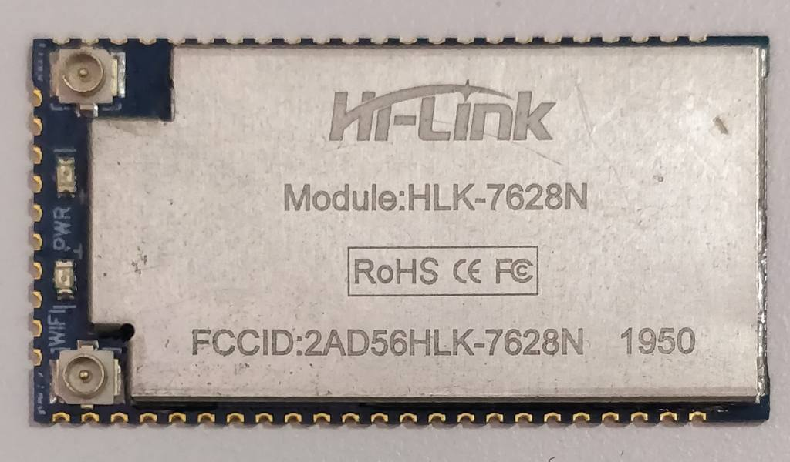
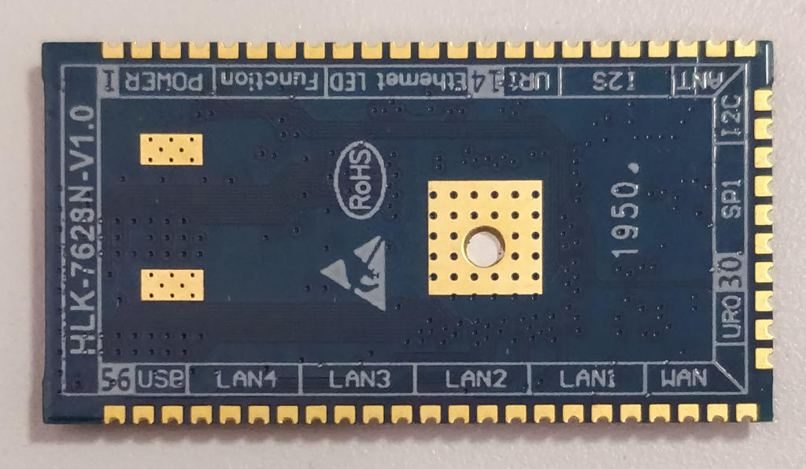

# Hi-Link HLK-7628N

This is the base Nerves System configuration for the Hi-Link [HLK-7628N](https://www.hlktech.com/en/Product/Details/23)

| Feature              | Description                     |
| -------------------- | ------------------------------- |
| CPU                  | MIPS 24KEc, 580MHz              |
| Memory               | 128MB DRAM                      |
| Storage              | 32MB NOR Flash                  |
| Linux kernel         | 5.4 w/ OpenWrt patches          |
| IEx terminal         | UART `ttyS0`                    |
| GPIO, I2C, SPI       | TODO                            |
| ADC                  | No                              |
| PWM                  | No                              |
| UART                 | 3, ttyS0 ~ ttyS3                |
| Camera               | No                              |
| Ethernet             | Yes, 5 port, 100M               |
| WiFi                 | Yes                             |
| Bluetooth            | No                              |
| Audio                | No                              |

## Usage

TODO

*NOTE*: kernel build will fail at patching stage, due openwrt-patches not installed

## Firmware flash

### First time

TODO

### Upgrade

TODO

## Tech Details

TODO, add overview

### Linux kernel & OpenWrt patches

TODO

### Network setup

TODO

### Storage & flash layout

TODO

## Resource & reference

https://openwrt.org/toh/hwdata/hi-link/hi-link_hlk-7628n
